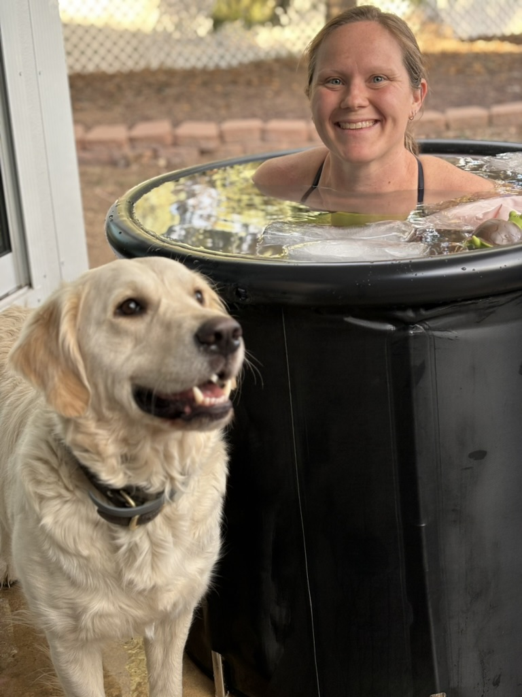

Corey Murphey is a marathon open water swimmer based in Colorado. Originally from Missouri, Corey started swimming before she could walk and has never looked back. She swam throughout childhood and through high school -- ultimately deciding to attend Stanford University, where she served as manager of the varsity women's swimming team. After about 8 years away from competitive swimming, she tried her hand at some longer swims as a mental reprieve from her (rather flexible) "day-job" as a PhD Student in computer science. And let's just say she fell in love with the water again. 

When she is not swimming, Corey is likely working on her doctoral dissertation or hanging out with her three unruly but incredibly adorable Golden Retrievers. 

## Swim Highlights
- Double Lake Tahoe Length (July 21-22, 2026), 20:54
    - 4th Double Crossing
    - Fastest N-S directional swim ~10 hours
    - Fastest N-S-N Double Crossing, 20:54
- Double Lake Titicaca - Zamaitis Route (March 18, 2026), 9:32
    - Fastest one-way (Copacabana to Isla Del Sol), 4:32
    - First double crossing
    - Fastest double crossing
- Catalina Channel (August 7-8, 2025), 8:59
- Strait of Gibraltar (May 11, 2026), 3:42
    - tandem with Sue McKay, Nikko Price, and Marcelo Dietrich
- [2025 SCAR swim challenge](https://c-murph-swim.github.io/p/scar-2025/), Overall Champion
- 2024 Horsetooth 10k, 7th OA, 1st place AG
- 2023 Horsetooth 10k, 10th OA

📸 Sriranga Ramaswamy 