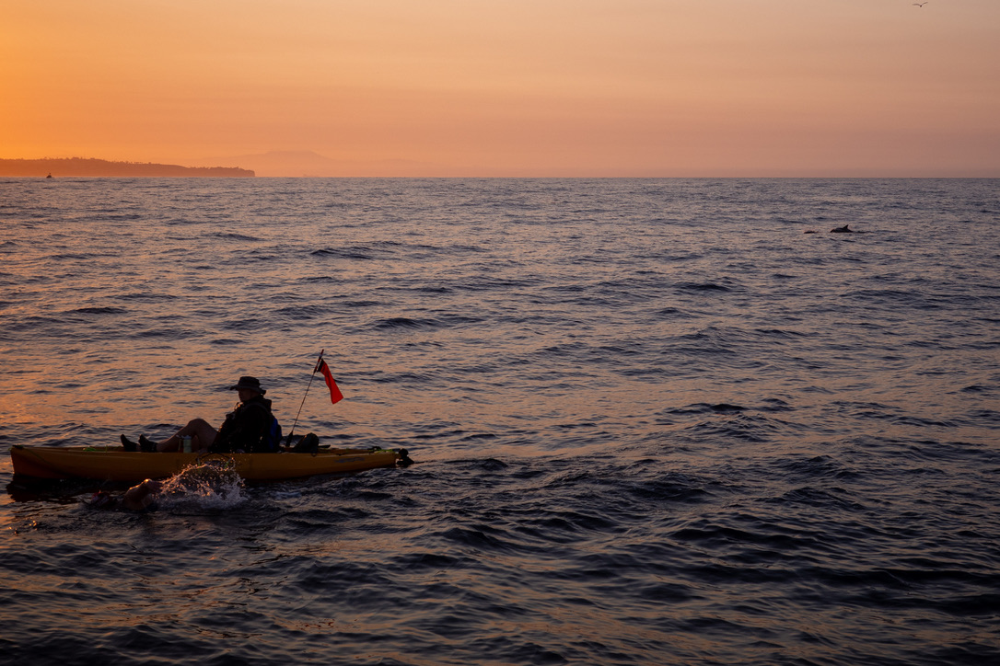

# Catalina Channel Crossing -  August 7-8, 2025

  

Almost a year in the making and it did not disappoint. I had the most amazing crew: Helen, Max, Jake, and Lauren of the Pacific Star; my kayakers Neil van der Byl and John Trevino; my crew…mom (Jill Murphey), Amie Freeman, and Zach Brown (also my support swimmer); and my observers Alex Pine and Elaine van Vleck.

This swim got off to a rough start with an embarrassing bout of seasickness and large swells for the first few hours of the swim. I got through it mostly because I just didn’t want to get back on the boat and get sick again, not by some extreme feat of strength or bravery, believe me… But I was greeted with one of the most magical sunrises ever: several schools of dolphins, a seal that swam right under me, jellyfish, fish, worms, and a friendly face in Zach swimming with me at dawn. And I even swam right over a seal in the final minute of this swim at the most beautiful finish beach… a sight for sore eyes. This swim is both tough and rewarding at the same time. I cannot say I loved every minute of it, but I will surely remember it with fondness — because I was surrounded by beautiful people, creatures, views, and water 💙. Somehow this kid from central Missouri is an ocean swimmer now!

I am so grateful to my crew, my coaches (Neil Hailstone and de facto coach/open water bible/swim buddy Sarah Thomas), Boulder Aquatic Masters, my pilates teacher Erica Ruge, my PT Jim Heafner, training buddies, and countless friends and family who picked me up and encouraged me along this journey. Love you all 💙

A final note about the song in this reel: a few weeks ago my friend, Tim Stumbaugh invited me to a Jack's Mannequin at Red Rocks. The song "Swim" has been on my mind ever since. And it helped me through the toughest parts of this swim. I thought a lot about both the literal and figurative meanings of the lyrics —and it was so relevant at every moment. Hence it stayed with me all 9 hours. This song was important to me when it was released many (many) moons ago and it still is apparently. So yay for nostalgic music that plays on repeat for almost 9 hours in your head. And yay for working through tough moments any way you can (even when it’s not pretty).

