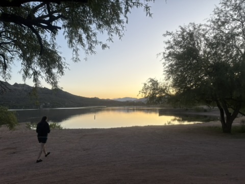

# SCAR 2025

  

When I started writing this, I thought I would be able to fit everything in one, concise post. After a few hours of writing, this became a beast of an essay, so I apologize for the length. If you just want the highlights, look no further: I swam ~40 miles over 4 days and [**won**](https://www.webscorer.com/seriesresult?seriesid=387371) (overall!!). This race pushed me in ways I had never imagined before. But this race also revealed the areas where I excel. It was a huge confidence boost that I needed, especially after breaking my elbow in November. I am super proud of just finishing all 4 days, but I am even more grateful that I had the opportunity to meet the countless kind-hearted, determined, and gritty people I swam with over those 4 days. The SCAR community is unparallelled. 

If you want to read an (also long) interview I did with Steven Munatones, head over to the [Daily News of Open Water](https://dailynewsofopenwaterswimming.com/corey-murphey-reflects-on-winning-the-scar-buckle/). This article discusses my preparation leading up to SCAR and my next great adventure (Catalina). 

## Day 0 : Patty's Swim and Welcome Party

Patty's swim is not an official part of SCAR, nor is there a set course. I mention this swim because I think it highlights what SCAR is all about: community. Swimmers and kayakers alike swim a simple out and back loop in Saguaro Lake. After about 200 yards, I stopped because I didn't know where I was going. Thankfully, some friendly strangers -- who I later learned were Maggie Regan and Ryan Stille -- set me back on course. I was just happy to be in the water after a long drive to Arizona the previous day.  

  

My mom, Jill, and my friend Amie also swam at Patty's swim. Amie, a triathlete, braved the cold water (in a wetsuit, of course). My mom, being the safety-oriented physician she is, wore a black Stanford cap in my honor. One of these days, she will learn about visibility in open water 🤦‍♀️. On my way back from what I think was the "island" we were told to swim to, I met up with Amie and my mom. We swam back to the dock and braved the rocky exit from the water. There are lots of prickly and spiky things in Arizona. Just keep that in mind when you decide to walk barefoot on a rocky path. 

After the swim, Amie, my mom, and I went back to our AirBnB to relax and pack for the coming days while also staying out of the very hot Arizona sun. As Colaradans, we were very unprepared for 90+F degree temperatures. Being me, I brought an abundance of black clothing that was way too warm for the Arizona weather. 

  

Patty's swim also marked 5 months to the day post elbow fracture, which I acquired walking across a parking lot... as if you needed further evidence that I am a swimmer who can't walk on land. This is just to illustrate that even the lead up to this event was a challenge. I had to rebuild my endurance base in January through kicking and dealt with some hand numbness from ulnar nerve impingement throughout the bulk of my training. My elbow is fine now. And I firmly believe that my elbow fracture ultimately helped me. I had to revise my stroke mechanics, strength training, and training volume, which all helped me get through some of the heavier weeks of training leading up to SCAR. 

#### Party time! 

  

Kent (the race organizer) hosts a welcome party at his incredible house the evening before SCAR begins. There was a band, swag, good lasagna, and a motivational speaker (Chris Dorris). More importantly, the vibes were incredible (I cannot believe I just wrote the word "vibes"). I was surrounded by so many successful channel swimmers with remarkable swimming resumes. It was amazing to hear all of their stories and meet the people I would be swimming with over the subsequent days. Amie found her people (she is British, but identifies as Aussie because why not?)

If I'm honest, this is when my imposter syndrome set in a bit. While I have swum since I was in diapers, SCAR would be my first attempt at anything longer than a 10k in open water. Being surrounded by so many swimmers who have swum A LOT further than I have was a bit intimidating. But I remained excited to learn from them over the following few days.

  

Amie, my unofficial social media manager, made me take the obligatory check-in pictures. So please enjoy. 

  

As the party wrapped up, we escaped back to our AirBnB to pack for day 1! My four day long SCAR adventure was set to begin in just under 12 hours.

## Day 1: Saguaro (~8.5 miles)

  

SCAR begins! Check-in began at 7:30 am. As a chronic early person, I arrived at 7:10 am after a 30 minute drive from our home base in Mesa, AZ. In hindsight, my early arrival set me up for an even longer day than I needed, but I would have been much more anxious had I arrived any later. That said, I was proud of myself for only arriving 20 minutes early. 18 year old Corey would have insisted on arriving an hour early (my apologies to everyone who knew me and had to deal with me when I was a teenager). 

  
&nbsp; &nbsp; &nbsp;
  

Kent and his team of volunteers do a phenomenal job of getting the kayakers and swimmers to where the need to be each day. They have to get 40 kayaks, 40 swimmers, and 40 kayakers from a meeting area to the swim start each day. The swim starts were largely inaccessible by car, so we met near the finish and boated up to the starts. To do that, the volunteers daisy-chain the kayaks and pull them behind pontoon boats that carry the swimmers and their kayakers. This takes time, especially with pontoon boats. With only a few boats available, on day 1, it took about 2.5 hours to carry waves one and two up to a staging area near the start. 

  

Since desitin (aka diaper cream, the sunscreen of choice for open water swimmmers) is extremely messy, the organizers asked us not to put it on before we got to the staging area to protect the boats' upholstery. We were told that we would have ample time to lube up at the staging area once we got there. However, because it had taken wave 3 so long to get from the docks to the staging area, we were given less than 5 minutes. This meant I had to rush to put on desitin. I missed a few spots. I also didn't have time to help my mom set up the kayak (e.g., tethering bottles, loading dry bags, setting up a camera). I think we faired okay given the rush, but I definitely took this rush as a lesson for the following days: **Be prepared to have only a few minutes before the start. Put on a layer of sunscreen before you get on the boats just in case. Bring fewer things on the kayak to facilitate faster setup.**

  

It seemed like I had barely gotten off the boat before I had to get back on. Pirate, one of the volunteer boat captains, took us about 1 mile upstream from the staging area to the start buoys - red buoys that sit in front of the dam between Saguaro and Canyon lakes. Meanwhile, our kayakers paddled from the staging area to start. We would meet up with them somewhere between the start and the staging area. Pirate told us that we were to jump off the boats into water (of unknown temperature) when he said go. We were to swim about 10 meters to the buoys, put one hand on the buoys and raise the other in the air, then Kent (on another boat) would tell us to go when all of our hands were in the air. So I jumped, put one hand on the buoy and the other in the air, and heard go! So I went! 

My wave -- Ildiko Szekely, Susan McKay, and Alain Simac -- started fast. Ildy took off immediately, which was expected given how fast she is in the pool. Since drafting isn't allowed in these races, I just focused on settling into a rhythm as quickly as possible rather than trying to swim in Ildy's draft. Kent had warned us there was a shallow rock about 400 meters downstream from the start and to veer right of the rock to avoid it. So I tried to stay near the right wall of the canyon as best I could. Since I didn't know how I would handle the open water elements and the distance (independently, I had confidence I could handle each), I took my time at the start. I had a long four days ahead of me. After about 800 yards, I found my mom (my kayaker) and let her take control of the navigation. 

*Now for the biggest disclaimer of this post: I lose all sense of time and distance when I swim. Sometimes 5 minutes feels like 4 hours; sometimes 4 hours feels like 5 minutes. So take any claim I make about how long something took with a grain of salt. I don't know what I'm talking about.*

The first half of this swim was relatively uneventful. I fed as planned: 10 oz of Infinit Go Far mix every 30 mins, 2-3 Clif Shot Blocs every 90 minutes. This plan seemed to work. The Shot Blocs revived me a bit (yay, caffeine!). I thought about my breathing pattern: 2 breaths to the right, 1 to the left when. This was the pattern I tried to stick with the whole race. I got comfortable with swimming through short-lived and extremely cold currents. I don't know what menopause feels like (yet), but I'd imagine the hot flashes were a bit like what I felt in Saguaro. 

About halfway (or what I thought was halfway), boat traffic picked up a bit. Fortuntely, we were out of the narrow canyon portion of the swim and the boats were giving us a great deal of space. While there was some wake, it wasn't terrible. I timed my stroke to the waves and continued on. 

At one point, I nearly swam into some brush. That was a bit creepy. I was worried about snakes. We had been warned that sometimes rattlesnakes make their way into the lake (they can swim!). And, if I were a snake, I would live in that brush. But again, my mom corrected my line and I put the brush and the snakes out of my mind as quickly as I could.

On the boat ride out, Patty told us to look out for a big rock on the right shore -- that would be our sign we were about to go through the last slot canyon before entering the main lake where the finish was. I didn't see this rock. Around the time I think I passed it, my mom moved me a bit closer to the shore, paddling on my right side to protect me from boats and wake. Unfortunately, on one particular corner, we got a bit too close and I nearly grounded myself on some shallow rocks. So I think I was a bit too distracted to see the big rock, which was probably good. I learned over the following days it is better to not know where you are in these swims than to know. Sometimes ignorance is bliss. 

Then came the long stretch. Since I hadn't seen the rock yet, I thought I had a fair bit of swimming left. It was around this time that I started to worry about my mom. After one feed, she got about 50 meters behind me. I sighted to the nearest canyon wall, but was a bit concerned about her. That was the only time all week I got more than 10 meters away from her. I ended up doing backstroke for a bit to figure out what was going on. After the race, I found out that her shoes had melted and were sticking to the kayaks pedals. She was taking off her shoes so that she could pedal in her socks. 

Then she started looking around a lot - up, down, left, right. It looked like she was lost or bonking. I missed a feed somewhere in this section. This is the only time in the race where I was legitimately worried about my mom. I thought we had another canyon section to swim through - we were still a ways away from the finish. If she was bonking already, we were in trouble.

But then we turned a sharp, blind left corner and I saw the red finish buoys 25 meters ahead. I had a bit left in the tank (see: I thought we had about 4 more miles to go) so I sprinted to the buoys near the finish boats (note to self: next time sprint to the nearest buoy, not the one that's closest to the boat...). As I touched the buoy, I lifted my head to hear Kent on a megaphone saying "Nice job, Corey!" 

I swam to the finish boats that would take us back to the parking area while the kayakers kayaked (more!!) across the body of the lake. It was only an extra 1/2 mile for them, but I felt for my mom who was already having a rough day and had to kayak even more. That said, she didn't complain. 

  

All in all, it was a great start to the week. Finishing that distance gave me a great deal of confidence going into the second day. I felt like I had handled the open water elements well, fed sufficiently, and didn't over-exert myself. 

> **3:15, 2nd place Stage 1, 2nd place OA**

### Highlights
- Survived my longest open water swim to date
- Feed plan seemed to work well
- Kept calm even in cold currents
- Stroke thrived in boat wake
- Minimal soreness! 
- Burritos at the finish 

### Lowlights
- Melted shoes and getting separated from the kayak for a bit
- Missed a feed
- Air temp! It was a hot day for the kayakers
- Rushed start = not enough time to put on sunscreen = bad cap tan 
- Brought wayyy to much stuff with us. Needed to consolidate for the next days
- Amie wasn't able to get on the support boats. We had hoped she would be able to spectate, but it wasn't to be. 

## Day 2: Canyon (~9 miles)

  

Everyone told me that Canyon is the prettiest and their favorite swim of SCAR. So I was excited for this day. Since I felt pretty good, I wanted to try to push a bit more. I knew I could finish the distance, so I wanted to try to do it a bit faster. 

  

The meeting point for Canyon is a bit further from Mesa -- a 45 minute drive instead the 30 mins to Saguaro. That morning, we had to pack up and check out of our AirBnB to prepare for the move to the Apache Lake Resort later that afternoon. So we arrived at the meeting point around 7:20. I was better prepared with food, water, and a layer of sunscreen after learning my lesson at Saguaro. I was prepared to wait around for hours today. First major lesson of SCAR: adapt each day! 

Fortunately, things went a bit quicker before the Canyon start. After about 45 minutes, I was on a boat to the start! And it was a fast boat! We got to the staging area before wave 1 had departed, leaving ample time to lube up with more sunscreen, desitin, and lanolin. I was so grateful for the extra time. But it wasn't too much extra time... just enough to lube up, pack up the kayak, and mentally prepare for the day. 

  

At the end of each day, Kent adjusts the waves so that swimmers be with other swimmers approximately their speed. So Wave 3 got a bit bigger -- now Maggie, Ryan, Jorge, and Stefan joined Ildy, Sue, and me. The ride up to the start was gorgeous. I tried to take in as much as possible, but alas even those gorgeous images are fading. 

  

The start procedure was the same as Saguaro -- hop off the boat, swim to the buoys, raise your hand in the air, listen for Kent to say "go!" We were all pros at this by now. As expected, Ildy took off. But on this day, I decided I was going to stay with her until I couldn't. Since the wave spacing was a bit shorter, we immediately starting making our way through the previous waves around the same time we found our kayakers. 

Side note: Ildy's kayaker was Chris Morgan, who was the assistant coach at Stanford when I was manager of the women's team. The world is incredibly small.  It was so cool to be able to swim alongside someone I worked with 13 years prior. 

Around 2 miles in, Ildy and I had moved to the front of the previous waves. We were swimming in parallel at that point. I felt good so I decided to move to the front. In retrospect, it was too early to do this, but race tactics are not my strength. As I made the pass to go around Ildy, my mom started screaming at me. Internally, I thought "I am passing someone, could you not scream at me please?" But she was just trying to get my attention so I would look at the speedboat that was floating alongside us. My dear friend Amie, whom we had left behind at the parking lot, was piloting a speed boat. My initial thought was "Huh... whose boat did Amie steal?" For the record, Amie didn't steal a boat; she rented one from the local marina. And then she followed the race for about 40 minutes, taking incredible pictures and being the all-around joy of a human she is. I think seeing Amie revived me quite a bit, so I kept pushing. 

  

I then led the race for the next 5-6 miles. I found this stressful. I started shorting my feeds because I could see Ildy right behind me at every feed. While I am a competitive person, I don't love feeling competitive. I'd rather just push myself than race other people. No shame or judgement to people who like racing. It's just not my favorite part of sport. And shorting feeds during long swims like this is a massive mistake. Taking an extra few seconds to gulp down a few extra calories can make the difference betweeen bonking and not. And I definitely bonked.

Since I didn't know where I was for most of the previous day, on the boatride to the start, I had tried to commit to memory some landmarks that could help me figure out where to time efforts. This was also a mistake. I kept thinking I was near the finish when we still had 2ish miles left. Ildy started to creep up on me with 1.5 miles to go. At the same time, boat traffic became intolerable. There were speed boats doing circles around us and jet skis flying by on narrow corners. With 1 mile to go, I heard Chris and my mom screaming and pointing at Ildy and me. With one breath to my left, I saw the world's biggest river boat (you know the ones with 3 decks that you'd expect to read about in a Mark Twain novel?). I have since learned that this party boat was called "Dolly." The wake was so big that I had to swim perpendicular to the boat (and the direction I was supposed to be going) to avoid getting sucked into the side of the boat. 

This was also when Ildy passed me. A bit rattled by our encounter with Dolly, bonking because of the shorted feeds, and with my triceps on fire, I had nothing left in the tank. I just needed to finish. I had some hope I could catch Ildy on the finishing stretch -- about 1000 yards from the corner to the finishing buoys. But, alas, I had burned my matches for the day. And then promptly grounded myself on some rocks near the turn. Ildy hammered for the last mile, rightfully putting me in my place. I was gassed at the finish. I guess given how hard I had swum most of the day, I was relatively okay. My triceps were sore, but I knew I could still tackle the beast, Apache, the next day. 

Ildy and I floated (by boat) back to the parking area. I then immediately got in the car to drive to the infamous Apache Lake Resort. We were told to avoid going back to Mesa due to road closures and to avoid driving to Apache in the dark. I didn't really understand why until we were sliding around on a 12% grade dirt road in my AWD SUV with a dirt road traction mode. That was a bit scary! Thank goodness I read the race emails and advice before driving to Apache! 

> **3:06, 2nd place Stage 2, 2nd place OA**

### Highlights
- Led the race most of the day
- Felt strong, even in boat wake and wind chop
- Amie "stole" a boat and met us on the lake
- Weather was much better
- Swimming alongside Ildy and Chris all day
- Handling higher paces over longer efforts
- Felt in sync with my mom today. We worked well together 

### Lowlights
- Boat traffic
- Dolly, the giant river boat
- Bonking, likely because of shorted feeds
- Tricep pain toward the end
- Getting "touched out" (well, from 1 mile out but still...)

## Day 3: Apache (~14.2 miles, but some say up to 17 miles)

  

Pre-SCAR, if you had asked me what I was most scared of, I would have said Apache. "Scared" might not be the right word. I just had a lot of questions about how I would handle it. Apache is known for its extremely cold start, brutal winds that cause kayaks to get separated from the swimmers, and non-trivial length. I had mentally prepared to be swimming for around 8 hours, but that is about 3x the duration of my longest swim pre-SCAR. I didn't know how my stomach would handle 8 hours of non-solid food. I didn't know how I would handle 8 hours of 60ish degree water. All of this is to say, I had a lot of questions about Apache going into it. So I focused on controlling what I could and staying patient. I think that approach was the best for me for the day. It wasn't about winning or racing; it was about finishing. 

  

Since Apache is a long day of swimming, the race starts a bit earlier. We meet at 5:30 am at the Apache Lake marina, which is a 2 minute walk from our hotel rooms at the resort. At least we didn't have to drive today! 

During the previous days, I had gotten quite hot by the time we got on the boats to the staging area. Having learned my lesson, I minimized the amount of clothes I brought with me to the Apache start. This was again a mistake. The boat ride to the staging area of Apache was incredibly cold. At some point, I had put on every item of clothing from my post-race dry bag and was still shivering. At least I had packed gloves, a beanie, and my changing poncho! 

  

When we arrived at the staging area, we were informed that the U-Haul filled with the rental kayaks had been left at the Apache lake marina, a 45 minute drive from the staging area. The private kayaks (mine included) were at the staging area already. Kent offered to let those with private kayaks start as soon as they wanted. While I appreciated that, I didn't want to spend the whole day on Apache alone. So my mom and I decided to wait for the rental kayaks to be delivered. As the sun came up, the staging beach got warmer so at least I wasn't cold anymore! 

After about an hour and half, the rented kayaks arrived and Waves 1, 2, and 3 all rushed to get ready, lube up, and get to the start. I put my desitin on a hair too early. The air still wasn't warm enough to stand in a suit with no clothes on, so I got a bit colder than was ideal when waiting for the start. The boat ride to the start was also, frankly, miserable. I have never shivered that much in my life. But fortunately we were greeted by the sight of the incredible Roosevelt dam before us. This monumental backdrop would be the start of this monumental day. 

  

Then the same procedure as the previous days. Hop off the boat, then... oh my goodness was that water cold. I heard a few squeals and yells from my fellow swimmers. The incredible Abigail Fairman, who had joined us for half of Apache, said, "Oh this is 56 degrees!" Other reports from that day said the start was 52. I thought it was mid-50s as well (no pins and needles, but definitely did take your breath away when you jumped in). As we swam toward the buoys, the current was apparent. The buoys were moving backward away from us. We were going to have to fight the current for a bit at the start. The start felt like it took ages (probably because of the cold). By the time I heard Kent say "go!" my arms were numb. It took a bit to get moving. 

For the first 500 yards or so, Ildy and I breathed toward each other before she split off to find her kayak. Susan McKay took off immediately from the start at a blistering pace. Susan is a seasoned channel swimmer, so I knew she was confident in her ability to hold that pace. I, however, had no idea what to expect. So I just tried to keep my stroke long and build for the first half. There was no need to race from the outset. 

About 1 mile in, I felt a warm current come up from underneath me. This was the weirdest feeling I've ever had in my life. It was bubbly and made my skin tingle. It had been so cold up to that point that I legitimately thought something was wrong with me. Was this hypothermia? I went through my hypothermia checklist: Can I talk? Are my cheeks numb? Are my hands cramping? Am I shivering? Have I stopped shivering? Am I able to think clearly? After going through that list, I realized that I was fine; it was just a weird, bubbly current. But I did almost stop to tell my mom about it (and she would have laughed at me).

  

Patience was the theme of the day. Even though I could see Sue, I told myself I had plenty of time to race her at the end. I took my time with my feeds. I was in it for the long haul and doing everything I could just to finish. 

There are 3 distinct sections of Apache: 1) the exit from the canyons. This section is relatively calm, a bit cold, but all in all pleasant. 2) the windy middle section. I was told to expect about 2 miles of headwind as we neared the Apache lake marina. In reality, it was more like 4 miles of headwinds and some boat traffic. and 3) the open sections where the winds do not die and come from every direction while the water gets cooler as you approach the finish dam. 

I enjoyed section 1. Section 2 was where I struggled most that day. I wasn't yet used to the wind and couldn't figure out a breathing pattern. We also detoured into a cove at one point -- a navigational error my mother has apologized profusely for. In her defense, that section was extremely hard to navigate with no markers. And the wind was frankly abusive at that point. We were promised that the wind would let up a bit as we passed the marina. My mom was sitting on my left at the time, blocking my view of the marina so I completely missed that we had passed it. Again, this was a good thing. I do better when I don't know where I am. Missing the marina meant I didn't know I was halfway until after I was well past halfway. 

Then there was the third section. The winds were brutal, but I was sort of used to them by this section. My mom lost her hat at one point (it blew off her head and is now resting at peace somewhere in the bottom of Apache). There was a 10 minute period where I don't think we moved at all due to the current. I could see the same rock on my left side for a very long time. I was about 1 minute behind Sue McKay throughout this whole section, never getting closer, but never letting her out of my sight. 

  

It looked like we were about to head back into the canyons (where Canyon had started the day before). As I had not studied the map well, I had no idea where the finish was or how much more I had. I decided that we had about 4 miles left and I just had to figure out how to deal with the headwind. 

Around that time, my elbow started to bug me -- an intense nervy feeling that clearly was coming from my ulnar nerve. To address it, I focused on my catch, making sure I was protecting my elbow as best I could and that I wasn't trying to stabilize my stroke with that arm as I breathed. Soon that pain subsided. I mention this moment because this was the only time I thought "oh no, I can't finish this" during all of SCAR. My elbow is my biggest weakness. I didn't want to do permanent damage to my elbow because Catalina is my real goal. That said, I needed to finish this to get to Catalina. 

Fortunately, my stroke correction fixed the pain and I could go back to my seemingly eternal battle with the wind. As we got closer to the entrance to the canyon, the wind pick up again and the water temperature dropped. The waves were so big that I couldn't really see in front of me. I saw a vaguely red thing in the distance, but decided that was a beach rather than the finish buoys. It was the buoys. I just didn't know it was the buoys until I was about 25 meters away from them, when I "sprinted" to finish. Sprinted might be a strong description for what I did...

Upon finishing, I floated in the water for a good 10 minutes with Sue McKay. Kent asked me how I felt and all I could say was "That wind is brutal." It was indeed brutal... but it was also foreshadowing for the next and final stage of SCAR. 

  

The first six of the finishers then boarded a boat with our kayakers and floated back to the marina, cheering for the swimmers who were still battling the wind along the way. I think this was one of my favorite moments of SCAR. I got to talk to Sue and Haley extensively about their upcoming swims and favorite parts of this experience. It was also on this boat ride that Sue and I learned we had moved into second and first place overall (respectively). Sadly, Ildy had a bout of tachycardia around 6km into the race and had to stop. 

  

> **5:59, 3rd place Stage 3, 1st place OA**

### Highlights
- I finished Apache! 
- I fed as planned
- I took my coach's advice and tried to be patient the whole swim. I think this worked well. 
- The boat ride back to the marina with the first six Apache finishers

### Lowlights
- Awful headwinds 
- A costly detour into a cove 
- Nervy elbow pain
- Late start due to forgotten kayaks
- Cold boat ride to the start
- COLD start. I was more bothered by the air temp than the water temp, but others thought the water temp was a bit too chilly.

## Day 4: Roosevelt (10 km sunset/night swim)

  

After 3 long days, Roosevelt is the final hoorah and celebration. It's also quite a bit different from the other 3 days. First, it's a triangle course outlined by buoys. Second, it's a night swim. Third, it's "only" 10km. There are very few photos from Roosevelt, largely because it was at night. So I apologize for the upcoming wall of text. 

After a halfday of recovery, we made our way from the Apache Lake Resort to Roosevelt Lake -- a massive lake to the east of Apache.  We were meant to meet around 4:30pm, which complicated my feeding schedule for the day. I really should have eaten around 1pm but opted to wait until 2:30pm when we got to the Roosevelt marina. Then, I didn't really want much food because I would be swimming in just a few hours. I just wasn't in the mood for a meal. So I downed a cheese sandwich. It worked, but it wasn't ideal. Next SCAR Lesson: think about your feeding schedule when you're not swimming too. 

At 4:30, we started to unload the U-Hauls and decorate them with lights for the night swim. My mom had packed the coolest Christmas lights... unfortunately, the AA batteries that powered them were not in the bag. So we pivoted as we had done countless times in the previous few days. I started zip-tying glow sticks to the kayak, while she added LED nav lights to parts of the kayak. We tried to zip tie a glowstick to the back of my suit, but the end of the zip tie bugged me. I was going to get annoyed if this stuck into my back the whole 10km. So we switched to a safety pin. 

Kent then presented black swim caps to those who finished Apache. It was the one celebration of the week and for good reason. Apache is such a beast. It was so wonderful to celebrate all of those who made it through that brutal wind, cold water, and long distance the previous day. 

Then Kent had each wave line up on the beach while he checked the lights on our caps and suits. Given we started at sunset, I had opted to use my clear goggles -- a different model and brand from the goggles I had used the previous days. I had practiced in these goggles in the pool but not open water. So I was a little nervous about what would happen with them (and for good reason as you'll see). 

We then waded out to our knees and waited for Kent's "Go!" Then we were off -- aiming for the first buoy situated on the other side of a channel between the main shore and a small island. Going into the day, I felt okay given how much I had swum over the previous 3 days. That said, I didn't feel like I had a lot of speed left in me. Since I was only 12 minutes in front of Sue McKay, I knew I had to keep her in my sight all day. I decided to take Roosevelt a bit quicker to get to the buoy first. But after we passed the island, the wind picked up. Unlike Apache, where we had a headwind most of the race, the wind here came from every direction. I couldn't find a breathing pattern that didn't force me to swallow water with every stroke cycle. My goggles started to leak almost immediately. Nevertheless, I kept on swimming. There was no way I was going to stop now because of some leaky goggles and more wind. I just needed to stay calm. 

After we passed the first buoy, we changed directions so that the wind was blowing directly at the side of my mom's kayak. Fortunately, she positioned herself right next to my right shoulder so I felt protected... she also blocked the sun for me, which helped a great deal with sighting. For the previous three days, I had done an excellent job of bilateral breathing. But now, when I tried to breathe to the left, I would swallow a mouthful of water. So I just decided to breathe right for this stretch. Later, my mom told me that the wind was so strong, the kayak nearly flipped on this stretch. Due to the wind, I missed at least two feeds in this stretch. It just wasn't safe to stop. All in all, I don't think it mattered much though. 

As we approached the second buoy, the sun was almost fully set. I felt something tug at my right ankle as I passed between the turn buoy and a light attached to it. I had gotten wrapped in the line. I did my best to make sure my mom's kayak propellers didn't get wrapped in the line, untangled myself, and then proceeded to turn around the buoy. We were now on the final stretch. 

Then the sun set. We started with the kayak on my left side. Unfortunately, knowing I am a right-dominant breather, we had put more lights on the right side of the kayak. So there was only one light illuminating the left side and it started to fall off. My mom grabbed it and then started to move it. Before I knew it, I was yelling "No! No! I need that light." So she kindly held it for me until she decided just to switch back to my right side. 

After a while swimming in complete darkness, I started to get a hang of it. I needed at least two points on the boat to follow (the nav lights were perfect) in order to see where the boat was going. But then I started to doubt my mom's navigational skills. The course instructions told us to "follow the light," but there were about 50 lights on shore. I swore we were going toward the island instead the boat ramp. After doubting my mom's vision for about 5 minutes, I finally decided that she was going to have a better chance of figuring out where we were going than I was. I might just have to endure a bit of a detour. 

My goggles continued to leak. After emptying them for the 4th time, I decided to change back into a tinted pair. When my goggles filled with water, the nav lights on the kayak started to merge and I lost all sense of direction. Tinted goggles that didn't leak were definitely preferable to leaky goggles that blurred my vision. 

As it was dark, I couldn't see anyone or anything except the few glowsticks and lights on the kayak. So I just tried to trust we would get there eventually. 

And then I ran headfirst into a tree in the middle of the lake. It didn't hurt me. I was just surprised by it. We lost a few glowsticks during this collision, which didn't help the vision situation. But I knew we had to be getting close to the finish. Moments later, I felt ground and saw lights to my left. Lifting my head, I heard my mom yell "Go to shore!" and then from the shore "No! Go to the buoy!" And then my mom said "Where's the buoy?" I couldn't see the buoy either. Turns out, it was about 20 meters away behind my mom and was lit by 3 glow sticks (so it was really really hard to see). I sprinted as hard as I could to that buoy, hoping no one had passed me in this navigational error. 

After touching it, I floated back to shore as a few people approached the finish. Maggie and Susan were right behind me -- I was so grateful to be done, but also to finish close to two people I respect so much. SCAR was over. I had finished it! And I had won it! 

> **2:42, 2nd place Stage, 1st place OA**

### Highlights
- I didn't (fully) panic while swimming at night with leaky goggles
- Swimming at sunset is a really cool experience
- Still felt strong even after 3 long days preceding this. I was able to take the pace out fast 
- Stayed calm in brutal winds. I learned something from Apache! 

### Lowlights
- I did not keep up with my feeds during this swim. Focus was more on the elements and finishing. 
- I puked shortly after the first buoy. The wake was making me a bit nauseous
- The safety pin holding my glowstick to the back of my suit came undone after the first buoy and started sticking me in the back. I ended up with some mild chafing on my back.
- I was VERY lost and briefly doubted my kayaker's navigational insights. I should have known better.

After the first male finisher (Jorge) came in, Kent asked us to meet him at the U-Haul, where he handed us the coolest belt buckles you've ever seen. These go to the top male and female finisher in the race. They have an inset picture of Apache lake and feature a Jack Kerouac quote on the back: **"Unforeseen events wait lurking to surprise you."** A perfect description of my week at SCAR. Then we uncermoniously packed up the kayak and started our journey home to Colorado - with a SCAR buckle in tow. 

  
&nbsp; &nbsp; &nbsp;
  

  
&nbsp; &nbsp; &nbsp;
  

## Final Thoughts

### Highlights
- There is no better community than the SCAR community. I am so grateful to have met such wonderful people, who love swimming and can push through the toughest conditions. 
- I learned a great deal about myself and my abilities as a swimmer and endurance athlete
- Spending 4 days with my mom and learning to trust her unconditionally

### Lowlights
- None. I wouldn't change this experience for anything.

## Miscellaneous pictures

Just a girl and her kayaker

  

Kayakers get to swim in Apache too! 

  

Some fearless ducks at Canyon

  

The finish buoy (when I could see it before Saguaro)

  

Once a bag lady, always a bag lady. 

  

The coolest kayaker

  

